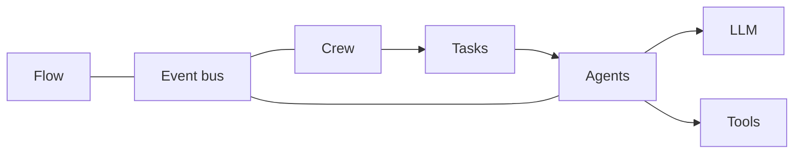

# The Big Picture

This page is the entry point for the field guide. It sets the runtime model in view before the deeper concept pages take over, so an experienced engineer can orient quickly and then move into the detailed paths for crews, agents, tasks, and flows.
The companion concept pages cover [Crews](https://docs.crewai.com/en/concepts/crews), [Agents](https://docs.crewai.com/en/concepts/agents), [Tasks](https://docs.crewai.com/en/concepts/tasks), and [Flows](https://docs.crewai.com/en/concepts/flows).

The runtime code lives in `lib/crewai/src/crewai/`, the standalone CLI lives in `lib/cli`, and the embedded `lib/crewai/src/crewai/cli/` tree remains part of an extraction in progress. This guide stays at the level of execution semantics: what happens when a crew or flow runs, how work moves between objects, and where responsibilities sit.

## Two execution engines

CrewAI organizes runtime work around two engines. A crew run starts in `kickoff()` and drives a shared task loop in `lib/crewai/src/crewai/crew.py`. Sequential and hierarchical execution both reuse that same loop, so the difference between them does not depend on a separate scheduler. In hierarchical mode, CrewAI validates or builds a manager agent first, then lets that agent delegate through ordinary tools rather than through a special planner layer.

Flow runtime follows a different shape. The engine in `lib/crewai/src/crewai/flow/runtime/__init__.py` and `lib/crewai/src/crewai/flow/flow.py` runs on asyncio and treats each method completion as an event. Routers fire first, one after another, until none of them trigger; then listeners run in parallel. That ordering gives the runtime a clear control surface for declarative orchestration.

## Core object map

### Crew

`lib/crewai/src/crewai/crew.py` owns the shape of a run. It gathers tasks, wires memory and knowledge, validates the runtime state, and launches sync or async kickoff paths.

### Agent

`lib/crewai/src/crewai/agent/core.py` and `lib/crewai/src/crewai/agents/agent_builder/base_agent.py` define how an agent comes together at runtime. The agent assembles its prompt, absorbs tools, memory, knowledge, and skills, and then hands that bundle to the executor layer.

### Task

`lib/crewai/src/crewai/task.py` decides how a unit of work sees context and how it runs. By default, each task receives the outputs of all earlier tasks; `Task.context` narrows that view, an empty context injects nothing, and the crew result comes from the last task output. As of this snapshot, `Task.async_execution` uses daemon threads and `Future` objects, while flows and async crew execution take a separate native asyncio path.

### LLM

`lib/crewai/src/crewai/llm.py` routes model requests to the right provider layer. As of this snapshot, supported providers go through native provider SDKs and everything else falls back to LiteLLM.

### Tools

`lib/crewai/src/crewai/tools/base_tool.py` turns tools into the schema driven objects the runtime can pass around. That layer also handles conversion between the internal tool form and the wrappers that external integrations expect.

### Event bus

`lib/crewai/src/crewai/events/event_bus.py` provides the shared event bus that the runtime uses for synchronous and asynchronous handlers. It sits beside the rest of the system and gives crews, agents, tasks, and flows one place to publish runtime events.

### Memory

`lib/crewai/src/crewai/memory/unified_memory.py` manages recall and storage for the crew runtime. Memory stays separate from checkpointing and from flow persistence, so the runtime can remember past work without conflating that state with resume logic.

### Knowledge

`lib/crewai/src/crewai/knowledge/knowledge.py` owns knowledge sources and the storage used for vector search. It complements memory, but it does not replace it, and the two systems answer different runtime questions.

### Hooks and interception

`lib/crewai/src/crewai/hooks/dispatch.py` and `lib/crewai/src/crewai/hooks/decorators.py` form the current interception layer. The dispatcher controls hook execution, filtering, and ordering, while the decorator surface gives the runtime a lightweight way to register interceptors.

## Object map

## Where to look in the code

- `lib/crewai/src/crewai/crew.py` anchors crew kickoff, the shared task loop, context accumulation, and manager behavior.
- `lib/crewai/src/crewai/task.py` anchors task context selection, guardrails, and both async task paths.
- `lib/crewai/src/crewai/agent/core.py` and `lib/crewai/src/crewai/agents/agent_builder/base_agent.py` anchor agent assembly, prompt building, tools, memory, knowledge, and skills.
- `lib/crewai/src/crewai/llm.py`, `lib/crewai/src/crewai/tools/base_tool.py`, and `lib/crewai/src/crewai/events/event_bus.py` anchor provider routing, tool conversion, and shared event delivery.
- `lib/crewai/src/crewai/memory/unified_memory.py`, `lib/crewai/src/crewai/knowledge/knowledge.py`, `lib/crewai/src/crewai/hooks/dispatch.py`, `lib/crewai/src/crewai/hooks/decorators.py`, `lib/crewai/src/crewai/flow/runtime/__init__.py`, and `lib/crewai/src/crewai/flow/flow.py` anchor memory, knowledge, interception, and the asyncio flow engine.
- See [Anatomy of a kickoff](./01-anatomy-of-a-kickoff.md) and [The flow scheduler](./06-the-flow-scheduler.md) for the deeper runtime paths.
