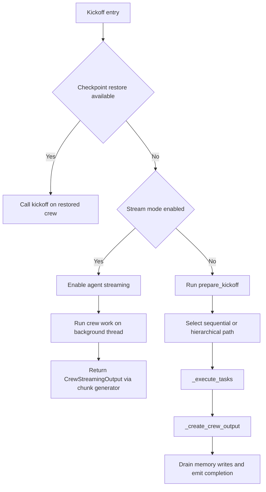

# Anatomy of a kickoff

`Crew.kickoff(inputs={...})` is the entry point that ties together checkpoint restore, task preparation, task execution, result assembly, and cleanup. The current source treats kickoff as a runtime path rather than a reference surface: the important question is what happens in order, what owns each handoff, and why the crew waits at each boundary before it moves on.

## Entry: `Crew.kickoff`

The kickoff method first checks `apply_checkpoint(self, from_checkpoint)` in `lib/crewai/src/crewai/crew.py`. When that call returns a restored crew, the method immediately re-enters `kickoff` on the restored instance, so the resumed crew follows the same runtime path as a fresh crew from that point forward.

When `self.stream` is true, kickoff enables agent streaming, starts the crew work on a background thread, and returns a `CrewStreamingOutput` backed by a chunk generator. That branch keeps the synchronous crew pipeline intact while exposing streaming chunks to the caller, and the deeper threading and state flow live in `./05-threads-asyncio-and-the-async-barrier.md` and `./07-where-state-lives.md`.

## Preparation: `prepare_kickoff`

`prepare_kickoff` in `lib/crewai/src/crewai/crews/utils.py` owns the work that has to happen before the task loop starts. It runs `before_kickoff_callbacks`, dispatches the execution and input interception points, normalizes the `inputs` mapping, extracts file objects from the inputs, stores all file inputs in the shared file store, and interpolates `{placeholders}` with their values before any task sees the prompt.

The same preparation step also resets the task output handler, sets task callbacks, establishes the first task trigger context, sets up the crew agents, and optionally runs planning. In the current source, kickoff uses that one preparation step to make the runtime state consistent before the process begins.

## Process dispatch

After preparation, `Crew.kickoff` chooses either `_run_sequential_process` or `_run_hierarchical_process`, and both paths funnel into `_execute_tasks` in `lib/crewai/src/crewai/crew.py`. Hierarchical execution changes which agent runs each task and when delegation tools appear, but it does not replace the scheduler itself; the task list still drives the order of execution. The process-level distinction is described in `./04-the-hierarchical-process.md`.

## The task loop

`_execute_tasks` walks the tasks in list order and asks `prepare_task_execution` for the current agent, tool set, and replay skip state. From there, the loop handles conditional-task skipping, replay-aware skipping, and context assembly from earlier outputs. The default context path accumulates prior task outputs, while explicit task context narrows the input set for that task.

Async tasks enter the loop as futures, and the next synchronous task or the end of the crew acts as the join barrier. When the loop reaches a synchronous task with pending async work, it waits for the outstanding futures, collects their outputs, and then hands the current task to the executor path. That handoff leads into `CrewAgentExecutor` in `lib/crewai/src/crewai/agents/crew_agent_executor.py`, which owns the agent turn itself; the executor loop is covered in `./02-the-agent-executor-loop.md`, and the async barrier behavior is covered in `./05-threads-asyncio-and-the-async-barrier.md`.

`_store_execution_log` writes each completed task into `self._task_output_handler`, and that log is the replayability seam. `replay()` reads those stored outputs, restores the saved context, and resumes from a chosen task instead of starting the crew from the beginning.

## Output assembly

`_create_crew_output` chooses the last non-empty task output as the crew result. It then aggregates token and usage metrics and builds a `CrewOutput` from `lib/crewai/src/crewai/crews/crew_output.py`, which carries `raw`, `pydantic`, `json_dict`, `tasks_output`, and `token_usage` fields. The final object keeps both the typed result and the plain task trail that produced it.

## Tail

After the main process returns, kickoff runs `after_kickoff_callbacks`, passes the result through `_post_kickoff`, and then clears file inputs in the final cleanup block. On success, `_create_crew_output` dispatches the output and execution-end hooks, drains memory writes, flushes the event bus, and emits `CrewKickoffCompletedEvent`; on failure, kickoff emits `CrewKickoffFailedEvent` from the exception path.

`_drain_memory_writes` exists because memory saves can still be in flight when kickoff otherwise looks finished. `Memory` in `lib/crewai/src/crewai/memory/unified_memory.py` uses a single-worker save pool, so kickoff waits for those saves before it emits completion and before listener teardown can close the event path.

## Side channels

The event bus carries kickoff lifecycle events throughout the run, including `CrewKickoffStartedEvent`, `CrewKickoffCompletedEvent`, and `CrewKickoffFailedEvent`, and it also carries the memory save events that surface during shutdown. Execution logs give `replay()` the state it needs to resume from a task instead of rebuilding the entire crew history.

## Lifecycle map

## Where to look in the code

- `lib/crewai/src/crewai/crew.py` — kickoff entry, process dispatch, task loop, output assembly, replay, and cleanup.
- `lib/crewai/src/crewai/crews/utils.py` — kickoff preparation, input normalization, file storage, agent setup, and planning.
- `lib/crewai/src/crewai/agents/crew_agent_executor.py` — executor loop that turns task context and tools into one agent turn.
- `lib/crewai/src/crewai/memory/unified_memory.py` — background memory saves, drain behavior, and save lifecycle events.
- `lib/crewai/src/crewai/crews/crew_output.py` — final crew result shape and usage metrics.
- `lib/crewai/src/crewai/events/types/crew_events.py` — kickoff lifecycle events.
- `./00-the-big-picture.md`, `./02-the-agent-executor-loop.md`, `./03-context-guardrails-and-retries.md`, `./04-the-hierarchical-process.md`, `./05-threads-asyncio-and-the-async-barrier.md`, `./06-the-flow-scheduler.md`, `./07-where-state-lives.md`, `./08-the-llm-layer.md`, `./09-about-this-site.md`