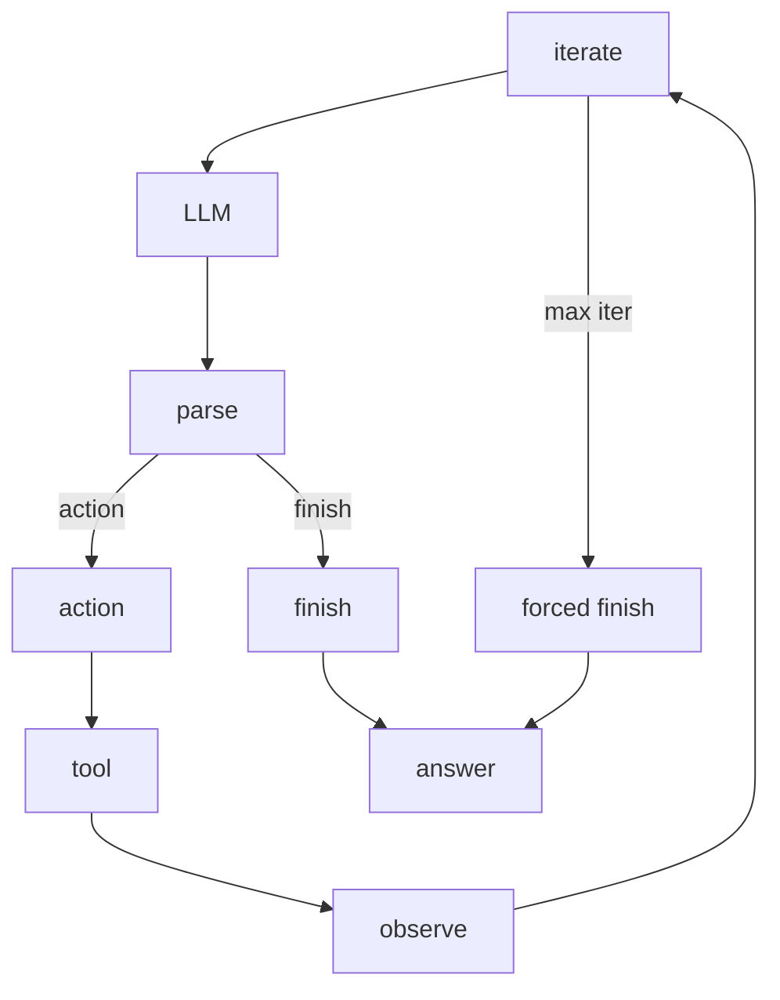

 # The Single Turn Agent Executor Loop

`CrewAgentExecutor` drives the inner loop of one agent turn. `Task` owns the outer lifecycle, `Agent` prepares the prompt and executor, and this page explains the machinery that runs inside the turn boundary. The class name remains `CrewAgentExecutor` in this path, although `Agent` now defaults to `AgentExecutor`.

## Two execution styles

The executor follows two runtime styles: the ReAct text loop and the native tool-calling loop. It picks the native path only when the LLM reports native function-calling support and the agent has tools to use; otherwise it stays in text mode. If the native path hits an unsupported-provider error, the executor adds text tool instructions and falls back to the ReAct loop.

## The ReAct loop as a sequence of stations

The text loop moves through a fixed order.

1. The executor checks `iterations` against `max_iter`.
2. When the limit is reached, `handle_max_iterations_exceeded` asks the LLM for one more pass and turns that reply into the final answer instead of failing the run.
3. `enforce_rpm_limit` pauses for the request cap.
4. The executor calls the LLM through the shared LLM wrapper.
5. The parser turns the response into `AgentAction` or `AgentFinish`.
6. An `AgentAction` flows into tool execution, and the executor appends the observation to message history.
7. The loop increments the counter and starts the next pass.

`ToolUsage` sits under this step. It selects the closest tool name, repairs malformed arguments, checks the cache and usage limits, emits usage and error events, and can treat a tool result as the answer when a tool marks `result_as_answer`.

## Recovery and retries

`handle_context_length` controls what happens when the conversation exceeds the model window. When `respect_context_window` stays true, it compacts the message list and retries. When that flag is false, the run raises `SystemExit` and stops. `handle_output_parser_exception` follows a different path: it appends the parser error as a user message so the model can try again with format guidance.

These retries keep the loop alive without hiding the failure. The executor does not silently ignore malformed output or an oversized context; it either repairs the conversation or stops the run with a clear runtime error.

## Native tool calling

The native path works with structured tool calls instead of ReAct text. It normalizes the different provider shapes into one internal form, then maps each call back to the original tool. When a batch contains several calls, the executor can run them through a `ThreadPoolExecutor` and collect the results in order.

The executor only parallelizes a batch when that batch stays safe to run together. If any call in the batch can end the turn with `result_as_answer`, or if any tool in the batch carries a usage cap, the executor keeps the calls sequential. After each call, it appends the assistant tool-call message and the tool result message back into history, then adds a short reasoning prompt so the model can decide whether to call another tool or finish.

The native path still honors the same exit rules as the text loop. It respects the iteration limit, it respects the request cap, and it falls back to text mode when the provider cannot support native function calling.

## Async and human feedback

The async path mirrors the sync path one-for-one. `ainvoke`, `_ainvoke_loop`, `_ainvoke_loop_react`, and `_ainvoke_loop_native_tools` follow the same branch points, but they call the async LLM and tool helpers instead of the sync ones. Async kickoffs and Flows use this path.

Human feedback stays inside the same executor rather than opening a separate branch. `_handle_human_feedback` and `_ahandle_human_feedback` hand the final answer to the provider in `human_input.py`. The provider can prompt for another pass, append the feedback as a new message, and rerun the loop until the reviewer submits a blank response. In training mode, the provider records the initial answer, the human note, and the improved answer as one feedback pass.

Adjacent pages cover the outer kickoff envelope, the context rules around retries, the async barrier, and the LLM layer: [/01-anatomy-of-a-kickoff.md](/01-anatomy-of-a-kickoff.md), [/03-context-guardrails-and-retries.md](/03-context-guardrails-and-retries.md), [/05-threads-asyncio-and-the-async-barrier.md](/05-threads-asyncio-and-the-async-barrier.md), and [/08-the-llm-layer.md](/08-the-llm-layer.md).

## Where to look in the code

- `lib/crewai/src/crewai/agents/crew_agent_executor.py`: the turn loop, branch selection, retries, tool execution, and feedback handoff.
- `lib/crewai/src/crewai/utilities/agent_utils.py`: LLM wrappers, parser error reinjection, context recovery, iteration forcing, and native tool helpers.
- `lib/crewai/src/crewai/tools/tool_usage.py`: tool lookup, argument repair, cache checks, usage limits, and usage events.
- `lib/crewai/src/crewai/core/providers/human_input.py`: human review prompts and repeated feedback passes.
- `lib/crewai/src/crewai/task.py`: the outer task lifecycle and the step hook boundary around agent execution.
- `lib/crewai/src/crewai/llm.py` and `lib/crewai/src/crewai/agents/parser.py`: provider capability checks and ReAct parsing into `AgentAction` and `AgentFinish`.