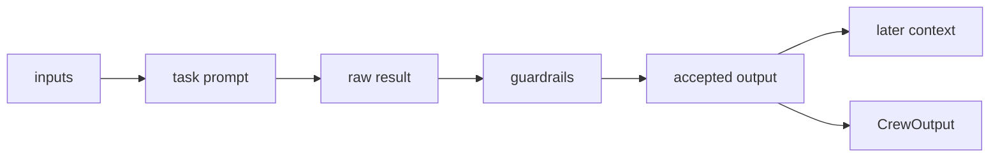

# Context, Guardrails, and Retries

## Overview

As of this repository snapshot, a crew does not hand one task result directly to the next task in a single hop. The runtime collects raw output from earlier tasks, validates the current task output after execution, and only then makes the accepted output available to later tasks.

This page describes that data flow. It focuses on runtime behavior, not configuration, and uses the same task loop that sequential and hierarchical crews share.

## The context rule

`Crew._get_context` decides what each task sees. When `task.context` stays at `NOT_SPECIFIED`, the crew calls `aggregate_raw_outputs_from_task_outputs` and folds the raw output from every preceding task into the prompt context. That is accumulation, not one-hop relay.

When `task.context` contains an explicit list, the crew calls `aggregate_raw_outputs_from_tasks` and collects only the named tasks' outputs. When `task.context` is empty or otherwise falsy, `_get_context` returns an empty string and injects nothing.

That rule matters in long sequential crews. Each later task can inherit the accumulated text of everything that came before it, so token cost rises and the prompt can drift if earlier work stays noisy. Hierarchical crews follow the same task loop, so the same context rule still applies there [hierarchical process](./04-the-hierarchical-process.md).

## What a task produces

A task produces `TaskOutput`. The important runtime fields are `raw`, plus optional structured forms in `pydantic` and `json_dict` when the task config asks for `output_pydantic` or `output_json`. `TaskOutput` also carries the task description, agent name, output format, and the last message list that led to the result.

`Task._export_output` and `Task._aexport_output` shape the raw agent result into those structured forms when the agent does not already return a `BaseModel`. When the agent already returns a `BaseModel`, the task keeps that model and serializes it into the task output. `output_file` writes the final accepted task output to disk after validation succeeds, so guardrails sit in front of persistence rather than after it.

`Crew._create_crew_output` then builds the crew result from the last valid task output. It copies that task's `raw`, `pydantic`, and `json_dict` fields into `CrewOutput`, while `CrewOutput.tasks_output` keeps the full per task history. Earlier outputs stay available on the task objects and in the collected history; they simply do not become the crew's top level `raw` result.

## Conditional skips

`ConditionalTask.should_execute` checks the previous task output at runtime. The crew calls `check_conditional_skip` just before the task would run. If the condition returns false, `get_skipped_task_output()` creates an empty raw `TaskOutput`, and the crew records the skip path.

A skipped task does not add useful text to later context accumulation because its `raw` field stays empty. The crew still preserves the skip in its execution record, so the run keeps a visible trace of the branch that did not execute.

## Guardrails and retries

The agent finishes first. Guardrail validation runs after that output exists and before the crew accepts it for downstream use. This is the boundary between raw generation and the output that later tasks consume.

Multiple guardrails run in order. Each guardrail receives the output produced by the previous one, so a guardrail can transform the result before the next guardrail sees it. If a guardrail fails, `_invoke_guardrail_function` or `_ainvoke_guardrail_function` re-executes the task with a validation error message injected as context. The task retries up to `guardrail_max_retries` additional attempts; `max_retries` remains only as the deprecated older name. If the retries run out, the task raises an exception.

`LLMGuardrail` creates a validating agent and asks it to judge the task result against the guardrail description. `HallucinationGuardrail` currently acts as a no-op placeholder in the open-source repository: it logs that hallucination detection does not run there and returns the raw output unchanged.

## Inputs come first

Inputs passed to `kickoff(inputs=...)` interpolate into task descriptions and expected outputs before execution begins. The run therefore starts with inputs at the top, carries accepted outputs forward as accumulated context, and ends with one crew result.

## Where to look in the code

- `lib/crewai/src/crewai/crew.py` builds context, runs the task loop, and creates `CrewOutput`.
- `lib/crewai/src/crewai/task.py` shapes `TaskOutput`, runs guardrails, and writes `output_file`.
- `lib/crewai/src/crewai/tasks/conditional_task.py` decides whether a conditional task runs.
- `lib/crewai/src/crewai/crews/utils.py` prepares kickoff inputs and skip handling.
- `lib/crewai/src/crewai/utilities/formatter.py` concatenates raw task output for context.
- `lib/crewai/src/crewai/tasks/llm_guardrail.py` and `lib/crewai/src/crewai/tasks/hallucination_guardrail.py` define the validating and placeholder guardrails.