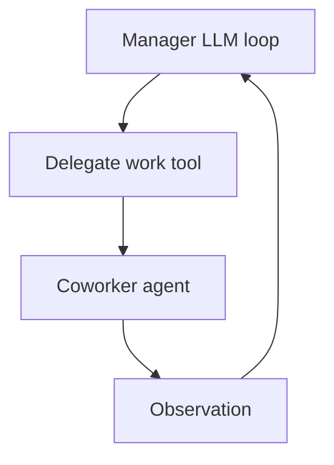

# The hierarchical process

 As of this repository snapshot, the hierarchical process gives CrewAI a manager turn, not a pre-run scheduler. It runs the same task list through a manager executor that may delegate from inside the task turn, and the sibling pages in [Anatomy of a kickoff](./01-anatomy-of-a-kickoff.md), [The agent executor loop](./02-the-agent-executor-loop.md), and [Context guardrails and retries](./03-context-guardrails-and-retries.md) anchor the surrounding runtime path.

For configuration background, see the official docs pages for [processes](https://docs.crewai.com/en/concepts/processes), [hierarchical process](https://docs.crewai.com/en/learn/hierarchical-process), [custom manager agent](https://docs.crewai.com/en/learn/custom-manager-agent), and [sequential process](https://docs.crewai.com/en/learn/sequential-process). This page stays focused on the runtime behavior in the codebase.

## Same task list, different executor

The hierarchical process keeps task order stable. Both `Crew._run_hierarchical_process` and `Crew._run_sequential_process` call `_execute_tasks(self.tasks)`, so the crew still walks the task list in the defined task order.

The difference sits in executor choice, not in scheduling. In hierarchical mode, `Crew._get_agent_to_use` returns `self.manager_agent`, so the manager executes every task turn. The code does not reorder tasks ahead of time, and it does not preassign work to other agents before execution starts.

## The manager comes from code, not from a schedule

When no manager agent exists yet, `Crew._create_manager_agent` builds one on the fly. It resolves the manager model, loads localized prompt text with `get_i18n(prompt_file=self.prompt_file)`, and reads the `hierarchical_manager_agent` strings from `lib/crewai/src/crewai/translations/en.json` for the role, goal, and backstory.

The synthesized manager receives `AgentTools(agents=self.agents).tools()`, and the crew turns on `allow_delegation=True`. That makes delegation available from the first manager turn. If a caller supplies `manager_agent`, the crew still forces `allow_delegation = True`. If that manager already has tools, the code logs a warning, clears `manager.tools`, and raises `Exception("Manager agent should not have tools")` instead of trying to merge tool sets.

## Delegation happens as an ordinary tool call

`DelegateWorkTool` and `AskQuestionTool` live in `lib/crewai/src/crewai/tools/agent_tools/`, and both inherit from `BaseAgentTool`. The manager sees them as ordinary tools inside its executor loop, not as a separate planning phase.

`BaseAgentTool._execute` resolves the target coworker by role name with lenient string cleanup. It collapses whitespace, removes double quotes, and casefolds the name, then performs exact equality against the available agent roles after the same normalization. That behavior gives the crew tolerant name matching, but it does not guess from meaning or infer a best match.

After the tool selects a coworker, it creates a `Task` for that agent and calls `selected_agent.execute_task(...)` synchronously inside the tool call. The coworker’s answer returns as the tool observation, so the manager receives the result before it decides whether to continue, ask again, or finish.

## The same delegation path appears elsewhere too

The same delegation tools also reach non manager agents. When `allow_delegation` is set, `Crew._prepare_tools` routes through `_add_delegation_tools` or `_update_manager_tools`, and those helpers call `Agent.get_delegation_tools`. In other words, hierarchical mode makes delegation the centerpiece, but it does not invent a separate mechanism.

## Hierarchical and sequential make different trade-offs

Hierarchical works best when the manager LLM needs to decide, task by task, whether to delegate or ask for more information. Sequential fits better when the order already exists and predictability matters more than runtime delegation.

Hierarchical pays for that flexibility with extra tool and agent round trips on each handoff, and the outcome depends on the manager’s judgment at each turn. Sequential avoids that overhead when the task list already expresses the right order.

The loop below shows the manager turn and the delegation return path.

## Where to look in the code

 - `lib/crewai/src/crewai/crew.py` — chooses the process, creates the manager, and runs tasks in list order.
 - `lib/crewai/src/crewai/translations/en.json` — supplies the manager role, goal, backstory, and tool strings.
 - `lib/crewai/src/crewai/tools/agent_tools/agent_tools.py`, `lib/crewai/src/crewai/tools/agent_tools/delegate_work_tool.py`, and `lib/crewai/src/crewai/tools/agent_tools/ask_question_tool.py` — define the delegation tools.
 - `lib/crewai/src/crewai/tools/agent_tools/base_agent_tools.py` — normalizes coworker names and runs the selected agent synchronously.
 - `lib/crewai/src/crewai/agents/crew_agent_executor.py` — drives the manager’s LLM loop.
 - `lib/crewai/src/crewai/agent/core.py` — exposes delegation tools to agents that can delegate.