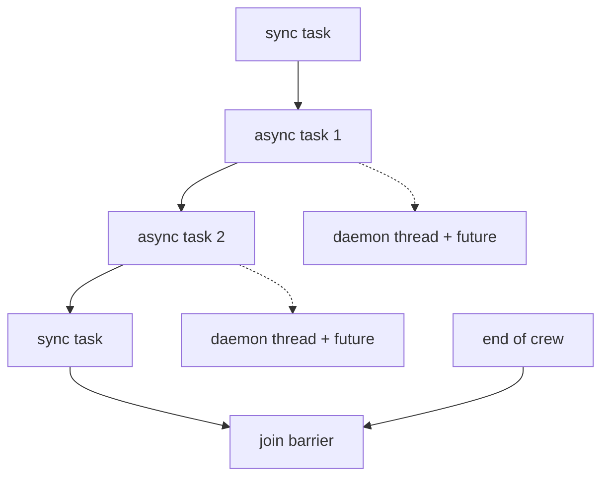

# Threads, asyncio, and the async barrier

This page maps the runtime concurrency model behind CrewAI execution. It explains when the crew, task, executor, event bus, and flow runtime use daemon threads, when they use asyncio, and why the word `async` names different mechanisms in different entry points. The goal is to give a clear mental model for overlap and ordering without rereading the whole pipeline.

## Two meanings of `async`

`Task.execute_async` and task level `async_execution=True` start a daemon `threading.Thread` and return a `concurrent.futures.Future[TaskOutput]`. That path still runs the same task execution core, but it runs it on a thread instead of on the event loop. In `Crew._execute_tasks`, those tasks collect as pending futures; in `Crew._aexecute_tasks`, the native async loop collects `asyncio.Task` objects and awaits them directly.

The native async mirror lives in `Task.aexecute_sync`, which awaits `_aexecute_core` and keeps the task inside asyncio. That path calls `agent.aexecute_task`, uses async guardrail handling, and reaches `async_convert_to_model` through `_aexport_output` when structured output is enabled. The crew's native async path uses that coroutine from `Crew._aexecute_tasks` and `Crew.akickoff`.

Crew kickoff exposes both bridge and native async entry points. `kickoff_async` wraps the sync `kickoff()` in `asyncio.to_thread`, so it makes a crew awaitable from async code without changing how the crew itself executes. `akickoff` uses `Crew._aexecute_tasks` and `Task.aexecute_sync`, so it keeps the whole crew on asyncio instead of crossing into the thread wrapper. The usage surface for the bridge path lives in [the public kickoff async guide](https://docs.crewai.com/en/learn/kickoff-async); the companion [kickoff for each guide](https://docs.crewai.com/en/learn/kickoff-for-each) covers the same user facing entry points from the outside.

For the broader kickoff shape, see [Anatomy of a kickoff](./01-anatomy-of-a-kickoff.md). This page only covers the runtime behavior after the call starts.

## The async barrier

The crew task loop accumulates consecutive async tasks as pending futures. Each async task starts immediately, then the loop keeps advancing through the task list. The first synchronous task after that run waits for the pending futures, records their outputs, and then continues. The end of the crew does the same work for anything that remains. That gives async tasks local overlap with their neighbors, not free running background work.

The barrier looks like this:

The crew model validators in `lib/crewai/src/crewai/crew.py` constrain that overlap in specific ways instead of banning all async placement. `validate_end_with_at_most_one_async_task` allows at most one trailing async task and raises when the tail contains more than one. `validate_async_tasks_not_async` rejects any `ConditionalTask` with `async_execution=True`. `validate_async_task_cannot_include_sequential_async_tasks_in_context` rejects an async task whose context reaches back to another async task in the same uninterrupted async run. `validate_context_no_future_tasks` rejects any context link to a future task. Together, those checks keep the async barrier local and ordered instead of letting task dependencies run ahead of the list.

The same barrier appears in the streaming and conditional branches. `Crew._handle_conditional_task` and `Crew._ahandle_conditional_task` both drain pending async work before they evaluate a conditional task, so a condition never runs against unfinished neighbors.

## Crew entry points and copy based fan out

`kickoff_for_each` runs a plain sequential loop over `self.copy()` for each input. Each copied crew runs independently, but the inputs still execute one after another. `kickoff_for_each_async` keeps the same copy per input isolation. When streaming is off, it fans out the copies with `asyncio.create_task` plus `asyncio.gather`. In streaming mode, `run_for_each_async` still builds separate copies first, starts each kickoff one by one, and then gathers the stream consumers that drain those independent runs.

For the public usage view of those entry points, see [kickoff for each](https://docs.crewai.com/en/learn/kickoff-for-each). For the runtime map that sits underneath them, see [Anatomy of a kickoff](./01-anatomy-of-a-kickoff.md).

## Native async mirrors in the executor and the Flow runtime

The agent executor carries the same split. `CrewAgentExecutor.ainvoke` mirrors `invoke`, and `_ainvoke_loop_native_tools` mirrors the native tool calling branch with `aget_llm_response`, `aexecute_tool_and_check_finality`, and async step callbacks. When one LLM turn returns several native tool calls, `_handle_native_tool_calls` spreads them across a `ThreadPoolExecutor` and keeps the result order stable. That gives one agent turn internal parallelism even when the larger crew stays sequential. For the surrounding loop, see [the agent executor loop](./02-the-agent-executor-loop.md).

The Flow runtime uses a different model again. `lib/crewai/src/crewai/flow/runtime/__init__.py` owns an asyncio native scheduler, and `Flow.kickoff_async` runs directly on the event loop. `Flow.kickoff()` keeps the sync surface alive by checking whether a loop already runs, then sending `asyncio.run(_run_flow())` through a one worker `ThreadPoolExecutor` when it needs a fresh loop. The Flow scheduler therefore owns its own async ordering rules, separate from the crew task barrier. See [the Flow scheduler](./06-the-flow-scheduler.md) for that runtime, and use the public [flows guide](https://docs.crewai.com/en/concepts/flows) only for user facing syntax.

The codebase keeps both models because it serves two different runtimes. Crew kickoff still needs a synchronous pipeline that can become awaitable without changing its core behavior, while Flow needs full event loop control for router ordering, listener fan out, and pause resume work. The thread bridge keeps the crew surface stable; the asyncio path gives Flow direct scheduling control.

## Event bus dispatch and completion

`lib/crewai/src/crewai/events/event_bus.py` runs sync handlers in a thread pool and async handlers on a dedicated daemon event loop thread. `emit()` tracks the futures that each branch creates, and `flush()` waits on those tracked futures before shutdown or completion code tears listeners down. That makes the bus a background dispatcher with completion tracking, not a fire and forget logger.

The bus also keeps the sync and async paths separate enough to fit both crew and flow execution. Sync handlers can run in the pool on the emitting side, while async handlers dispatch through `asyncio.run_coroutine_threadsafe` onto the loop thread. When callers need async only dispatch, `aemit()` skips the sync branch and calls only the async handlers.

## Sharp edges and design constraints

- `Crew._create_crew_output()` and the Flow finish path both drain background memory writes before they emit their completion event. That prevents a listener teardown from cutting off `MemorySaveCompletedEvent` or `MemorySaveFailedEvent` traffic. The memory state model in [Where state lives](./07-where-state-lives.md) explains why that barrier matters.
- `Flow.kickoff()` keeps a sync entry point inside a running event loop by copying the current context and running `asyncio.run(_run_flow())` on a single worker thread. That avoids nested loop errors without changing the flow's own asyncio runtime.
- `Task._execute_core()` handles both `self.callback` and `crew.task_callback` inside the synchronous task path. It checks `inspect.iscoroutine(cb_result)` and runs `asyncio.run(cb_result)` when a callback returns a coroutine, so async callback code can stay local to the callback without moving task execution onto asyncio.

## Where to look in the code

- `lib/crewai/src/crewai/task.py` — thread backed `execute_async`, native async `aexecute_sync`, and guardrail handling.
- `lib/crewai/src/crewai/crew.py` — crew task barrier, `kickoff_async`, `akickoff`, `kickoff_for_each`, `akickoff_for_each`, and task order validation.
- `lib/crewai/src/crewai/crews/utils.py` — `run_for_each_async` and copy per input isolation.
- `lib/crewai/src/crewai/agents/crew_agent_executor.py` — native async executor mirror and parallel native tool call execution.
- `lib/crewai/src/crewai/events/event_bus.py` — daemon event loop thread, handler futures, and flush behavior.
- `lib/crewai/src/crewai/flow/runtime/__init__.py` — asyncio native Flow runtime and fresh loop escape hatch.
- `lib/crewai/src/crewai/memory/unified_memory.py` — background writes and drain before completion behavior.