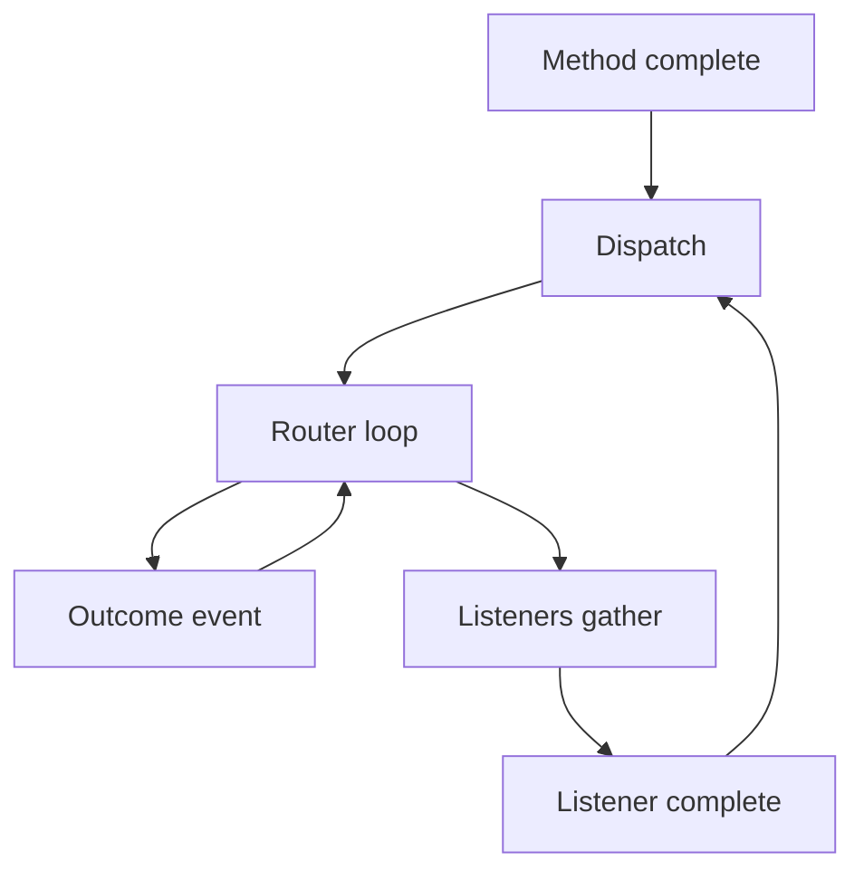

## Overview

CrewAI Flows read like decorators on a class, but `FlowMeta` makes the class object itself carry the trigger-graph metadata. The runtime treats that class shape as the source of truth for starts, listeners, routers, persistence, and human feedback, so the wiring stays declarative and inspectable instead of being discovered step by step during execution.

This page covers the runtime model that the decorator reference omits. For the surface API and user-facing examples, see [Flows](/en/concepts/flows), [Mastering Flow State](/en/guides/flows/mastering-flow-state), and [Human Feedback in Flows](/en/learn/human-feedback-in-flows).

## The graph under the decorators

The runtime does not guess at behavior step by step. `lib/crewai/src/crewai/flow/dsl/_utils.py` scans the wrapped methods on the Flow class, collects the stamped metadata, and builds a static `FlowDefinition` from that class shape. `Flow.flow_definition()` in `lib/crewai/src/crewai/flow/runtime/__init__.py` materializes that definition lazily the first time code asks for it, so the graph is created on first access rather than rebuilt on every kickoff.

The result looks like a compiled graph, but it still comes from ordinary Python class metadata. The decorators mark intent; the runtime reads that intent through the class metadata and then schedules against the resulting definition.

## `kickoff()` and `kickoff_async()`

`kickoff()` gives synchronous callers a safe entry point into an asynchronous engine. On the normal path it calls `asyncio.run()` around the async execution path. If code calls it from inside an event loop, the wrapper takes the escape hatch in `lib/crewai/src/crewai/flow/runtime/__init__.py`: it copies the current context and runs that coroutine on a fresh worker thread through `ThreadPoolExecutor`.

`kickoff_async()` drives the real scheduling loop. It restores state when the caller supplies a prior state identity, hydrates or merges any input data, emits `FlowStartedEvent`, and then runs the start methods that belong to the current state of the flow. The method also enforces the boundary between the two hydration systems: `from_checkpoint` and `restore_from_state_id` target different sources of state, so the runtime rejects combining them.

That order matters. State restoration and input hydration happen before the engine starts dispatching methods, so every downstream listener sees the same live state object that the start method saw.

## Dispatch order

`_execute_listeners` in `lib/crewai/src/crewai/flow/runtime/__init__.py` acts as the center of the scheduler. After a method finishes, the runtime does not fan everything out at once. It first runs routers sequentially in a loop until no more routers fire. Each router return value becomes a new trigger event, so a router can chain into another router before the runtime lets normal listeners run.

After routing settles, the runtime fans listeners out with `asyncio.gather()`, except for the special racing path described below. That fan out uses coroutines on one event loop. It does not spawn threads for listener concurrency.

The dispatch order therefore looks like this:

1. A method completes and returns a value.
2. Routers run one at a time until the router chain stops.
3. Each router result becomes the next event label.
4. Normal listeners run together on the event loop.
5. Listener completions feed back into the same dispatch loop.

## `and_()` and `or_()`

`lib/crewai/src/crewai/flow/dsl/_conditions.py` builds the condition trees for `and_()` and `or_()`, and the runtime evaluates those trees through `_find_triggered_methods`, `_condition_met`, `_fired_or_listeners`, `_rearm_or_listeners_for_trigger`, `_build_racing_groups`, and `_execute_racing_listeners`.

`and_()` waits until every named event has arrived for the listener’s subscription key. The runtime records each seen trigger in `_pending_events` and only clears that subscription after the whole condition passes.

`or_()` behaves differently when it listens to more than one event. The runtime treats those listeners as one shot for the current cycle and tracks them in `_fired_or_listeners`, guarded by a lock. That lock prevents repeated firings from the same cycle and keeps concurrent dispatch from racing the bookkeeping.

Only exclusive multi-event `or_()` groups enter the racing path. When the runtime sees a group that no other listener shares, it starts all members together, waits for the first successful completion, and cancels the losers. Other listeners in the same batch still run normally.

That design keeps `and_()` predictable, keeps multi-event `or_()` from firing twice in one cycle, and still lets mutually exclusive alternatives compete when the graph calls for it.

## State and persistence

`self.state` is the shared state object for the whole Flow instance. The runtime treats it as one live object that every method reads and writes. In practice that object can be a plain dict or a Pydantic model, and both shapes carry an identity field so the runtime can track the run across hydration and persistence.

The `@persist` decorator in `lib/crewai/src/crewai/flow/persistence/decorators.py` adds a save and restore layer between runs. The decorator only stamps metadata; `Flow._persist_method_completion()` in the runtime saves the state after a persisted method completes. The runtime then reads that metadata and picks the right backend when it needs to write a snapshot.

`from_checkpoint` follows a separate path in `lib/crewai/src/crewai/flow/runtime/__init__.py`. `restore_from_state_id` asks the persistence layer for a previous snapshot, while `from_checkpoint` restores a checkpointed runtime state. The code keeps those systems separate and rejects a call that tries to combine them.

## Crews and human feedback

`lib/crewai/src/crewai/flow/runtime/_actions.py` lets a Flow method build and await a Crew through `CrewAction.run()`. The flow engine does not treat Crew as special. It simply awaits the method result, whether that result comes from a plain method body, an awaited crew, or another async action.

Human feedback follows the same scheduling model. `lib/crewai/src/crewai/flow/human_feedback.py` defines the feedback data, and `_run_human_feedback_step` in the runtime collects, collapses, and stores the result when a method asks for feedback. If the feedback path pauses execution, the runtime saves the pending feedback context and the current state, then returns to the dispatch loop from the restored flow.

## Dispatch cycle

## Where to look in the code

- `lib/crewai/src/crewai/flow/runtime/__init__.py` — kickoff, state hydration, router and listener dispatch, persistence, and human feedback.
- `lib/crewai/src/crewai/flow/dsl/_utils.py` — class metadata scan that builds the `FlowDefinition`.
- `lib/crewai/src/crewai/flow/flow_definition.py` — declarative contract for methods, state, persistence, and feedback.
- `lib/crewai/src/crewai/flow/dsl/_conditions.py` — `and_()` and `or_()` condition trees.
- `lib/crewai/src/crewai/flow/runtime/_actions.py` — runtime execution of crew and other Flow actions.
- `lib/crewai/src/crewai/flow/persistence/decorators.py` and `lib/crewai/src/crewai/flow/human_feedback.py` — persistence metadata and feedback payloads.